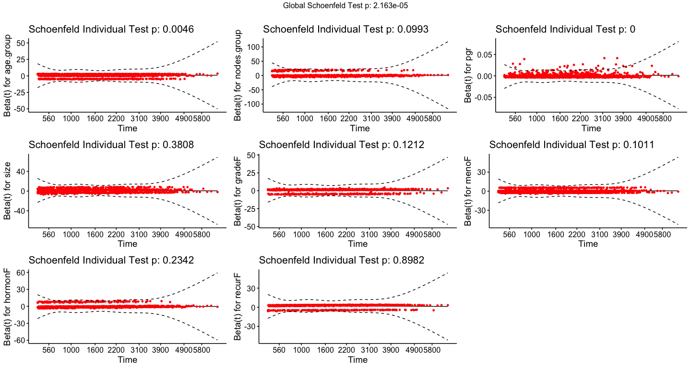

Survival_Analysis_cancer
================
Melvin Galera
2024-03-26

- [I. Overview](#i-overview)
- [II. Objective](#ii-objective)
- [III. Data](#iii-data)
- [III. Exploratory Analysis](#iii-exploratory-analysis)
  - [A. Univariate Analysis](#a-univariate-analysis)
  - [Censoring](#censoring)
- [III. Kaplan-Meier Survival Curves and Log-Rank
  Tests](#iii-kaplan-meier-survival-curves-and-log-rank-tests)
- [IV. Cox proportional hazard regression
  models](#iv-cox-proportional-hazard-regression-models)
  - [Hazard Ratio](#hazard-ratio)
- [V. Model Diagnostics](#v-model-diagnostics)
  - [Hazard Ratio](#hazard-ratio-1)

------------------------------------------------------------------------

## I. Overview

The dataset has 2982 observations and 15 variables:

- `pid` : patient identifier
- `year` : year of surgery  
- `age` : age at surgery
- `meno` : menopausal status (0 = premenopausal, 1 = postmenopausal)
- `size` : tumor size (factor with levels: \<=20, 20-50, 50\<)
- `grade` : differentiation grade
- `nodes` : number of lymph nodes
- `pgr` :progesterone receptors (fmol/l)
- `er` : estrogen receptors (fmol/l)
- `hormon` : hormonal treatment (0 = no, 1 = yes)
- `chemo` : chemotherapy
- \`rtime\`\` : days to relapse or lost follow up
- \`recur\`\` : 0 = no relapse, 1 = relapse
- `dtime` : days to death or last follow up
- `death` : 0 = alive, 1 = dead

## II. Objective

The objective is to do survival analysis

## III. Data

Initial look at the structure and content of `insurance_df` dataset:

``` r
str(cancer_df)
```

    ## 'data.frame':    2982 obs. of  15 variables:
    ##  $ pid   : int  1 2 3 4 5 6 7 8 9 10 ...
    ##  $ year  : int  1992 1984 1983 1985 1983 1983 1993 1988 1988 1988 ...
    ##  $ age   : int  74 79 44 70 75 52 40 53 60 52 ...
    ##  $ meno  : int  1 1 0 1 1 0 0 1 1 0 ...
    ##  $ size  : Factor w/ 3 levels "<=20","20-50",..: 1 2 1 2 1 1 1 1 1 2 ...
    ##  $ grade : int  3 3 2 3 3 3 2 2 2 3 ...
    ##  $ nodes : int  0 0 0 0 0 0 0 0 0 5 ...
    ##  $ pgr   : int  35 36 138 0 260 139 13 1 627 316 ...
    ##  $ er    : int  291 611 0 12 409 303 4 4 151 976 ...
    ##  $ hormon: int  0 0 0 0 0 0 0 0 0 0 ...
    ##  $ chemo : int  0 0 0 0 0 0 0 0 0 0 ...
    ##  $ rtime : num  1799 2828 6012 2624 4915 ...
    ##  $ recur : int  0 0 0 0 0 0 0 0 0 0 ...
    ##  $ dtime : num  1799 2828 6012 2624 4915 ...
    ##  $ death : int  0 0 0 0 0 0 0 0 0 0 ...

``` r
cancer_df %>% head(10)
```

    ##      pid year age meno  size grade nodes pgr  er hormon chemo rtime recur dtime
    ## 1393   1 1992  74    1  <=20     3     0  35 291      0     0  1799     0  1799
    ## 1416   2 1984  79    1 20-50     3     0  36 611      0     0  2828     0  2828
    ## 2962   3 1983  44    0  <=20     2     0 138   0      0     0  6012     0  6012
    ## 1455   4 1985  70    1 20-50     3     0   0  12      0     0  2624     0  2624
    ## 977    5 1983  75    1  <=20     3     0 260 409      0     0  4915     0  4915
    ## 617    6 1983  52    0  <=20     3     0 139 303      0     0  5888     0  5888
    ## 51     7 1993  40    0  <=20     2     0  13   4      0     0  2491     0  2491
    ## 473    8 1988  53    1  <=20     2     0   1   4      0     0  4150     0  4150
    ## 362    9 1988  60    1  <=20     2     0 627 151      0     0  3919     0  3919
    ## 2182  10 1988  52    0 20-50     3     5 316 976      0     0  3647     0  3647
    ##      death
    ## 1393     0
    ## 1416     0
    ## 2962     0
    ## 1455     0
    ## 977      0
    ## 617      0
    ## 51       0
    ## 473      0
    ## 362      0
    ## 2182     0

    ##    pid   year    age   meno   size  grade  nodes    pgr     er hormon  chemo 
    ##      0      0      0      0      0      0      0      0      0      0      0 
    ##  rtime  recur  dtime  death 
    ##      0      0      0      0

    ##       pid              year           age             meno         size     
    ##  Min.   :   1.0   Min.   :1978   Min.   :24.00   Min.   :0.00   <=20 :1387  
    ##  1st Qu.: 753.2   1st Qu.:1986   1st Qu.:45.00   1st Qu.:0.00   20-50:1291  
    ##  Median :1504.5   Median :1988   Median :54.00   Median :1.00   >50  : 304  
    ##  Mean   :1505.0   Mean   :1988   Mean   :55.06   Mean   :0.56               
    ##  3rd Qu.:2254.8   3rd Qu.:1990   3rd Qu.:65.00   3rd Qu.:1.00               
    ##  Max.   :3007.0   Max.   :1993   Max.   :90.00   Max.   :1.00               
    ##      grade           nodes             pgr               er        
    ##  Min.   :2.000   Min.   : 0.000   Min.   :   0.0   Min.   :   0.0  
    ##  1st Qu.:2.000   1st Qu.: 0.000   1st Qu.:   4.0   1st Qu.:  11.0  
    ##  Median :3.000   Median : 1.000   Median :  41.0   Median :  61.0  
    ##  Mean   :2.734   Mean   : 2.712   Mean   : 161.8   Mean   : 166.6  
    ##  3rd Qu.:3.000   3rd Qu.: 4.000   3rd Qu.: 198.0   3rd Qu.: 202.8  
    ##  Max.   :3.000   Max.   :34.000   Max.   :5004.0   Max.   :3275.0  
    ##      hormon           chemo            rtime            recur       
    ##  Min.   :0.0000   Min.   :0.0000   Min.   :  36.0   Min.   :0.0000  
    ##  1st Qu.:0.0000   1st Qu.:0.0000   1st Qu.: 823.5   1st Qu.:0.0000  
    ##  Median :0.0000   Median :0.0000   Median :1940.0   Median :1.0000  
    ##  Mean   :0.1137   Mean   :0.1945   Mean   :2097.9   Mean   :0.5091  
    ##  3rd Qu.:0.0000   3rd Qu.:0.0000   3rd Qu.:3198.8   3rd Qu.:1.0000  
    ##  Max.   :1.0000   Max.   :1.0000   Max.   :7043.0   Max.   :1.0000  
    ##      dtime          death       
    ##  Min.   :  36   Min.   :0.0000  
    ##  1st Qu.:1607   1st Qu.:0.0000  
    ##  Median :2638   Median :0.0000  
    ##  Mean   :2605   Mean   :0.4266  
    ##  3rd Qu.:3555   3rd Qu.:1.0000  
    ##  Max.   :7043   Max.   :1.0000

## III. Exploratory Analysis

To perform EDA on the dataset, we perform univariate distribution of the
variables and the bivariate and multivariate relationships among the
variables.

### A. Univariate Analysis


Group some predictors: Age (“24-60”, “61-90”) and Nodes (0-10, 11-20,
20+) It is also better to factor other predictors such. as Grade, Meno,
Hormon, Chemo, Recur and death

    ## 'data.frame':    2982 obs. of  23 variables:
    ##  $ pid        : int  1 2 3 4 5 6 7 8 9 10 ...
    ##  $ year       : int  1992 1984 1983 1985 1983 1983 1993 1988 1988 1988 ...
    ##  $ age        : int  74 79 44 70 75 52 40 53 60 52 ...
    ##  $ meno       : int  1 1 0 1 1 0 0 1 1 0 ...
    ##  $ size       : Factor w/ 3 levels "<=20","20-50",..: 1 2 1 2 1 1 1 1 1 2 ...
    ##  $ grade      : int  3 3 2 3 3 3 2 2 2 3 ...
    ##  $ nodes      : int  0 0 0 0 0 0 0 0 0 5 ...
    ##  $ pgr        : int  35 36 138 0 260 139 13 1 627 316 ...
    ##  $ er         : int  291 611 0 12 409 303 4 4 151 976 ...
    ##  $ hormon     : int  0 0 0 0 0 0 0 0 0 0 ...
    ##  $ chemo      : int  0 0 0 0 0 0 0 0 0 0 ...
    ##  $ rtime      : num  1799 2828 6012 2624 4915 ...
    ##  $ recur      : int  0 0 0 0 0 0 0 0 0 0 ...
    ##  $ dtime      : num  1799 2828 6012 2624 4915 ...
    ##  $ death      : int  0 0 0 0 0 0 0 0 0 0 ...
    ##  $ age.group  : Factor w/ 2 levels "24-60","61-90": 2 2 1 2 2 1 1 1 1 1 ...
    ##  $ nodes.group: Factor w/ 3 levels "0-10","11-20",..: 1 1 1 1 1 1 1 1 1 1 ...
    ##  $ gradeF     : Factor w/ 2 levels "2","3": 2 2 1 2 2 2 1 1 1 2 ...
    ##  $ menoF      : Factor w/ 2 levels "No","Yes": 2 2 1 2 2 1 1 2 2 1 ...
    ##  $ hormonF    : Factor w/ 2 levels "No","Yes": 1 1 1 1 1 1 1 1 1 1 ...
    ##  $ chemoF     : Factor w/ 2 levels "No","Yes": 1 1 1 1 1 1 1 1 1 1 ...
    ##  $ recurF     : Factor w/ 2 levels "No","Yes": 1 1 1 1 1 1 1 1 1 1 ...
    ##  $ deathF     : Factor w/ 2 levels "No","Yes": 1 1 1 1 1 1 1 1 1 1 ...

    ##       pid              year           age             meno         size     
    ##  Min.   :   1.0   Min.   :1978   Min.   :24.00   Min.   :0.00   <=20 :1387  
    ##  1st Qu.: 753.2   1st Qu.:1986   1st Qu.:45.00   1st Qu.:0.00   20-50:1291  
    ##  Median :1504.5   Median :1988   Median :54.00   Median :1.00   >50  : 304  
    ##  Mean   :1505.0   Mean   :1988   Mean   :55.06   Mean   :0.56               
    ##  3rd Qu.:2254.8   3rd Qu.:1990   3rd Qu.:65.00   3rd Qu.:1.00               
    ##  Max.   :3007.0   Max.   :1993   Max.   :90.00   Max.   :1.00               
    ##      grade           nodes             pgr               er        
    ##  Min.   :2.000   Min.   : 0.000   Min.   :   0.0   Min.   :   0.0  
    ##  1st Qu.:2.000   1st Qu.: 0.000   1st Qu.:   4.0   1st Qu.:  11.0  
    ##  Median :3.000   Median : 1.000   Median :  41.0   Median :  61.0  
    ##  Mean   :2.734   Mean   : 2.712   Mean   : 161.8   Mean   : 166.6  
    ##  3rd Qu.:3.000   3rd Qu.: 4.000   3rd Qu.: 198.0   3rd Qu.: 202.8  
    ##  Max.   :3.000   Max.   :34.000   Max.   :5004.0   Max.   :3275.0  
    ##      hormon           chemo            rtime            recur       
    ##  Min.   :0.0000   Min.   :0.0000   Min.   :  36.0   Min.   :0.0000  
    ##  1st Qu.:0.0000   1st Qu.:0.0000   1st Qu.: 823.5   1st Qu.:0.0000  
    ##  Median :0.0000   Median :0.0000   Median :1940.0   Median :1.0000  
    ##  Mean   :0.1137   Mean   :0.1945   Mean   :2097.9   Mean   :0.5091  
    ##  3rd Qu.:0.0000   3rd Qu.:0.0000   3rd Qu.:3198.8   3rd Qu.:1.0000  
    ##  Max.   :1.0000   Max.   :1.0000   Max.   :7043.0   Max.   :1.0000  
    ##      dtime          death        age.group    nodes.group  gradeF   menoF     
    ##  Min.   :  36   Min.   :0.0000   24-60:1907   0-10 :2770   2: 794   No :1312  
    ##  1st Qu.:1607   1st Qu.:0.0000   61-90:1075   11-20: 190   3:2188   Yes:1670  
    ##  Median :2638   Median :0.0000                21-34:  22                      
    ##  Mean   :2605   Mean   :0.4266                                                
    ##  3rd Qu.:3555   3rd Qu.:1.0000                                                
    ##  Max.   :7043   Max.   :1.0000                                                
    ##  hormonF    chemoF     recurF     deathF    
    ##  No :2643   No :2402   No :1464   No :1710  
    ##  Yes: 339   Yes: 580   Yes:1518   Yes:1272  
    ##                                             
    ##                                             
    ##                                             
    ## 

Fit model for overall survival death: censoring status (0=
censored/alive, 1= dead) dtime: days until event or censoring

### Censoring

Model 1


Survival data representation using triplet (entry age, exit age, event)


Survival data representation using triplet (follow up time, event)


## III. Kaplan-Meier Survival Curves and Log-Rank Tests

A. Kaplan-Meier Curves

Model 1: OVERALL FIRST

``` r
mod01_sfit <- survfit(Surv(dtime, death) ~ 1, data = cancer_df)
```


    ##   strata median lower upper
    ## 1    All   4033  3888  4309

    ## Call: survfit(formula = Surv(dtime, death) ~ 1, data = cancer_df)
    ## 
    ##  time n.risk n.event survival std.err lower 95% CI upper 95% CI
    ##  1825   2084     753    0.744 0.00807        0.728         0.76

Generate KM curves for explanatory variables:

``` r
m1_age <- survfit(Surv(dtime, death) ~ age.group, data = cancer_df)
m1_nodes <- survfit(Surv(dtime, death) ~ nodes.group, data = cancer_df)
m1_pgr <- survfit(Surv(dtime, death) ~ pgr, data = cancer_df)
m1_er <- survfit(Surv(dtime, death) ~ er, data = cancer_df)

m1_size <- survfit(Surv(dtime, death) ~ size, data = cancer_df)
m1_grade <- survfit(Surv(dtime, death) ~ gradeF, data = cancer_df)
m1_meno <- survfit(Surv(dtime, death) ~ menoF, data = cancer_df)
m1_hormon <- survfit(Surv(dtime, death) ~ hormonF, data = cancer_df)
m1_chemo <- survfit(Surv(dtime, death) ~ chemoF, data = cancer_df)
m1_recur <- survfit(Surv(dtime, death) ~ recurF, data = cancer_df)

# define titles
titlelist <- list("Age", "Nodes", "pgr", "er", "Size", "Grade", "Meno", "Hormon", "Chemo", "Recur")

#Plot

survplots <- ggsurvplot(list(m1_age, m1_nodes, m1_size, m1_grade, m1_meno, m1_hormon, m1_chemo, m1_recur),
           pval = TRUE, pval.method = TRUE, conf.int = TRUE,
           risk.table = TRUE, fontsize = 4,
           risk.table.col = "strata",
           linetype = "strata",
           xlim = c(0, 7043),
           surv.median.line = "hv",
           ggtheme = theme_bw(), 
           palette = c("slateblue3", "peru", "green4"),
           risk.table.height = 0.30)

arrange_ggsurvplots(survplots, print = TRUE, ncol = 2, nrow = 4)
```


B. Log Rank test

By using log rank test, we can test if there is difference in the
ssurvival cureves of the categories/predictors.

Null hypothesis, Ho: the survival curves are equal Alternate hypothesis,
Ha: the survival curves are different for at least some intervals

Use `coxph` function.

``` r
log.rank.recur <- coxph(Surv(dtime, death) ~ recurF, data = cancer_df)
summary(log.rank.recur)
```

    ## Call:
    ## coxph(formula = Surv(dtime, death) ~ recurF, data = cancer_df)
    ## 
    ##   n= 2982, number of events= 1272 
    ## 
    ##              coef exp(coef) se(coef)     z Pr(>|z|)    
    ## recurFYes 2.03814   7.67631  0.07804 26.12   <2e-16 ***
    ## ---
    ## Signif. codes:  0 '***' 0.001 '**' 0.01 '*' 0.05 '.' 0.1 ' ' 1
    ## 
    ##           exp(coef) exp(-coef) lower .95 upper .95
    ## recurFYes     7.676     0.1303     6.588     8.945
    ## 
    ## Concordance= 0.711  (se = 0.006 )
    ## Likelihood ratio test= 988.1  on 1 df,   p=<2e-16
    ## Wald test            = 682  on 1 df,   p=<2e-16
    ## Score (logrank) test = 945.9  on 1 df,   p=<2e-16

The score for the log-rank test for recur is 945.9 with very low
p-value. This means we reject the null hypothesis that the survival
curves for recur are the same (as visually shown in KM curve)

<br>

#### Table \_\_. Log-rank test scores an dp-value for all covariates

<table style="border-collapse:collapse; border:none;">
<tr>
<th style="border-top: double; text-align:center; font-style:italic; font-weight:normal; padding:0.2cm; border-bottom:1px solid black; text-align:left; ">
Row
</th>
<th style="border-top: double; text-align:center; font-style:italic; font-weight:normal; padding:0.2cm; border-bottom:1px solid black; ">
Score..logrank..test
</th>
<th style="border-top: double; text-align:center; font-style:italic; font-weight:normal; padding:0.2cm; border-bottom:1px solid black; ">
df
</th>
<th style="border-top: double; text-align:center; font-style:italic; font-weight:normal; padding:0.2cm; border-bottom:1px solid black; ">
p.value
</th>
<th style="border-top: double; text-align:center; font-style:italic; font-weight:normal; padding:0.2cm; border-bottom:1px solid black; ">
Remark
</th>
</tr>
<tr>
<td style=" padding:0.2cm; text-align:left; vertical-align:top; text-align:left; ">
age.group
</td>
<td style=" padding:0.2cm; text-align:left; vertical-align:top; text-align:center; ">
53.4291
</td>
<td style=" padding:0.2cm; text-align:left; vertical-align:top; text-align:center; ">
1
</td>
<td style=" padding:0.2cm; text-align:left; vertical-align:top; text-align:center; ">
0.0000
</td>
<td style=" padding:0.2cm; text-align:left; vertical-align:top; text-align:center; ">
The survival curves have statistically significant differences.
</td>
</tr>
<tr>
<td style=" padding:0.2cm; text-align:left; vertical-align:top; text-align:left; ">
nodes.group
</td>
<td style=" padding:0.2cm; text-align:left; vertical-align:top; text-align:center; ">
220.5267
</td>
<td style=" padding:0.2cm; text-align:left; vertical-align:top; text-align:center; ">
2
</td>
<td style=" padding:0.2cm; text-align:left; vertical-align:top; text-align:center; ">
0.0000
</td>
<td style=" padding:0.2cm; text-align:left; vertical-align:top; text-align:center; ">
The survival curves have statistically significant differences.
</td>
</tr>
<tr>
<td style=" padding:0.2cm; text-align:left; vertical-align:top; text-align:left; ">
pgr
</td>
<td style=" padding:0.2cm; text-align:left; vertical-align:top; text-align:center; ">
23.6988
</td>
<td style=" padding:0.2cm; text-align:left; vertical-align:top; text-align:center; ">
1
</td>
<td style=" padding:0.2cm; text-align:left; vertical-align:top; text-align:center; ">
0.0000
</td>
<td style=" padding:0.2cm; text-align:left; vertical-align:top; text-align:center; ">
The survival curves have statistically significant differences.
</td>
</tr>
<tr>
<td style=" padding:0.2cm; text-align:left; vertical-align:top; text-align:left; ">
er
</td>
<td style=" padding:0.2cm; text-align:left; vertical-align:top; text-align:center; ">
0.5950
</td>
<td style=" padding:0.2cm; text-align:left; vertical-align:top; text-align:center; ">
1
</td>
<td style=" padding:0.2cm; text-align:left; vertical-align:top; text-align:center; ">
0.4405
</td>
<td style=" padding:0.2cm; text-align:left; vertical-align:top; text-align:center; ">
The survival curves have statistically non-significant differences
</td>
</tr>
<tr>
<td style=" padding:0.2cm; text-align:left; vertical-align:top; text-align:left; ">
size
</td>
<td style=" padding:0.2cm; text-align:left; vertical-align:top; text-align:center; ">
280.8799
</td>
<td style=" padding:0.2cm; text-align:left; vertical-align:top; text-align:center; ">
2
</td>
<td style=" padding:0.2cm; text-align:left; vertical-align:top; text-align:center; ">
0.0000
</td>
<td style=" padding:0.2cm; text-align:left; vertical-align:top; text-align:center; ">
The survival curves have statistically significant differences.
</td>
</tr>
<tr>
<td style=" padding:0.2cm; text-align:left; vertical-align:top; text-align:left; ">
gradeF
</td>
<td style=" padding:0.2cm; text-align:left; vertical-align:top; text-align:center; ">
54.2198
</td>
<td style=" padding:0.2cm; text-align:left; vertical-align:top; text-align:center; ">
1
</td>
<td style=" padding:0.2cm; text-align:left; vertical-align:top; text-align:center; ">
0.0000
</td>
<td style=" padding:0.2cm; text-align:left; vertical-align:top; text-align:center; ">
The survival curves have statistically significant differences.
</td>
</tr>
<tr>
<td style=" padding:0.2cm; text-align:left; vertical-align:top; text-align:left; ">
menoF
</td>
<td style=" padding:0.2cm; text-align:left; vertical-align:top; text-align:center; ">
55.0560
</td>
<td style=" padding:0.2cm; text-align:left; vertical-align:top; text-align:center; ">
1
</td>
<td style=" padding:0.2cm; text-align:left; vertical-align:top; text-align:center; ">
0.0000
</td>
<td style=" padding:0.2cm; text-align:left; vertical-align:top; text-align:center; ">
The survival curves have statistically significant differences.
</td>
</tr>
<tr>
<td style=" padding:0.2cm; text-align:left; vertical-align:top; text-align:left; ">
hormonF
</td>
<td style=" padding:0.2cm; text-align:left; vertical-align:top; text-align:center; ">
23.6860
</td>
<td style=" padding:0.2cm; text-align:left; vertical-align:top; text-align:center; ">
1
</td>
<td style=" padding:0.2cm; text-align:left; vertical-align:top; text-align:center; ">
0.0000
</td>
<td style=" padding:0.2cm; text-align:left; vertical-align:top; text-align:center; ">
The survival curves have statistically significant differences.
</td>
</tr>
<tr>
<td style=" padding:0.2cm; text-align:left; vertical-align:top; text-align:left; ">
chemoF
</td>
<td style=" padding:0.2cm; text-align:left; vertical-align:top; text-align:center; ">
0.4947
</td>
<td style=" padding:0.2cm; text-align:left; vertical-align:top; text-align:center; ">
1
</td>
<td style=" padding:0.2cm; text-align:left; vertical-align:top; text-align:center; ">
0.4818
</td>
<td style=" padding:0.2cm; text-align:left; vertical-align:top; text-align:center; ">
The survival curves have statistically non-significant differences
</td>
</tr>
<tr>
<td style=" padding:0.2cm; text-align:left; vertical-align:top; text-align:left; border-bottom: double; ">
recurF
</td>
<td style=" padding:0.2cm; text-align:left; vertical-align:top; text-align:center; border-bottom: double; ">
945.9441
</td>
<td style=" padding:0.2cm; text-align:left; vertical-align:top; text-align:center; border-bottom: double; ">
1
</td>
<td style=" padding:0.2cm; text-align:left; vertical-align:top; text-align:center; border-bottom: double; ">
0.0000
</td>
<td style=" padding:0.2cm; text-align:left; vertical-align:top; text-align:center; border-bottom: double; ">
The survival curves have statistically significant differences.
</td>
</tr>
</table>

<br>

## IV. Cox proportional hazard regression models

These models give us estimates of the “hazard ratio”

A. Univariable Cox model (same as above)

B. Multivariable Cox model (except er and chemoF)

``` r
surv.model <- coxph(Surv(dtime, death) ~ age.group + nodes.group + pgr + size +
                      gradeF + menoF + hormonF + recurF, data = cancer_df)
summary(surv.model)
```

    ## Call:
    ## coxph(formula = Surv(dtime, death) ~ age.group + nodes.group + 
    ##     pgr + size + gradeF + menoF + hormonF + recurF, data = cancer_df)
    ## 
    ##   n= 2982, number of events= 1272 
    ## 
    ##                        coef  exp(coef)   se(coef)      z Pr(>|z|)    
    ## age.group61-90    0.2240471  1.2511299  0.0767418  2.919  0.00351 ** 
    ## nodes.group11-20  0.5181303  1.6788857  0.0912903  5.676 1.38e-08 ***
    ## nodes.group21-34  0.0465676  1.0476689  0.2618326  0.178  0.85884    
    ## pgr              -0.0005280  0.9994722  0.0001174 -4.496 6.93e-06 ***
    ## size20-50         0.4245920  1.5289665  0.0640982  6.624 3.49e-11 ***
    ## size>50           0.8332948  2.3008871  0.0881264  9.456  < 2e-16 ***
    ## gradeF3           0.1908043  1.2102226  0.0704163  2.710  0.00674 ** 
    ## menoFYes          0.2422161  1.2740695  0.0794312  3.049  0.00229 ** 
    ## hormonFYes        0.0535491  1.0550088  0.0889749  0.602  0.54728    
    ## recurFYes         1.9372098  6.9393616  0.0789520 24.537  < 2e-16 ***
    ## ---
    ## Signif. codes:  0 '***' 0.001 '**' 0.01 '*' 0.05 '.' 0.1 ' ' 1
    ## 
    ##                  exp(coef) exp(-coef) lower .95 upper .95
    ## age.group61-90      1.2511     0.7993    1.0764    1.4542
    ## nodes.group11-20    1.6789     0.5956    1.4038    2.0078
    ## nodes.group21-34    1.0477     0.9545    0.6271    1.7502
    ## pgr                 0.9995     1.0005    0.9992    0.9997
    ## size20-50           1.5290     0.6540    1.3485    1.7336
    ## size>50             2.3009     0.4346    1.9359    2.7347
    ## gradeF3             1.2102     0.8263    1.0542    1.3893
    ## menoFYes            1.2741     0.7849    1.0904    1.4887
    ## hormonFYes          1.0550     0.9479    0.8862    1.2560
    ## recurFYes           6.9394     0.1441    5.9445    8.1007
    ## 
    ## Concordance= 0.774  (se = 0.006 )
    ## Likelihood ratio test= 1256  on 10 df,   p=<2e-16
    ## Wald test            = 960.4  on 10 df,   p=<2e-16
    ## Score (logrank) test = 1271  on 10 df,   p=<2e-16

To check if the multivariable cox model is better than a complex one
(complete)

    ## Analysis of Deviance Table
    ##  Cox model: response is  Surv(dtime, death)
    ##  Model 1: ~ age.group + nodes.group + pgr + size + gradeF + menoF + hormonF + recurF
    ##  Model 2: ~ age.group + nodes.group + pgr + er + size + gradeF + menoF + hormonF + chemoF + recurF
    ##    loglik  Chisq Df Pr(>|Chi|)  
    ## 1 -8899.1                       
    ## 2 -8896.1 5.9876  2     0.0501 .
    ## ---
    ## Signif. codes:  0 '***' 0.001 '**' 0.01 '*' 0.05 '.' 0.1 ' ' 1

P-value is high which means we can use the reduced model.

    ## Call:
    ## coxph(formula = Surv(dtime, death) ~ age.group + nodes.group + 
    ##     pgr + er + size + gradeF + menoF + hormonF + chemoF + recurF, 
    ##     data = cancer_df)
    ## 
    ##   n= 2982, number of events= 1272 
    ## 
    ##                        coef  exp(coef)   se(coef)      z Pr(>|z|)    
    ## age.group61-90    0.2577827  1.2940576  0.0781703  3.298 0.000975 ***
    ## nodes.group11-20  0.5116511  1.6680431  0.0914657  5.594 2.22e-08 ***
    ## nodes.group21-34  0.0011451  1.0011458  0.2627343  0.004 0.996522    
    ## pgr              -0.0004742  0.9995260  0.0001215 -3.903 9.48e-05 ***
    ## er               -0.0001919  0.9998081  0.0001128 -1.701 0.088857 .  
    ## size20-50         0.4224261  1.5256585  0.0641180  6.588 4.45e-11 ***
    ## size>50           0.8167511  2.2631351  0.0884674  9.232  < 2e-16 ***
    ## gradeF3           0.1936178  1.2136324  0.0704742  2.747 0.006008 ** 
    ## menoFYes          0.3036060  1.3547351  0.0834620  3.638 0.000275 ***
    ## hormonFYes        0.0568856  1.0585347  0.0889748  0.639 0.522598    
    ## chemoFYes         0.1347615  1.1442639  0.0802104  1.680 0.092938 .  
    ## recurFYes         1.9395115  6.9553524  0.0789935 24.553  < 2e-16 ***
    ## ---
    ## Signif. codes:  0 '***' 0.001 '**' 0.01 '*' 0.05 '.' 0.1 ' ' 1
    ## 
    ##                  exp(coef) exp(-coef) lower .95 upper .95
    ## age.group61-90      1.2941     0.7728    1.1102    1.5083
    ## nodes.group11-20    1.6680     0.5995    1.3943    1.9956
    ## nodes.group21-34    1.0011     0.9989    0.5982    1.6755
    ## pgr                 0.9995     1.0005    0.9993    0.9998
    ## er                  0.9998     1.0002    0.9996    1.0000
    ## size20-50           1.5257     0.6555    1.3455    1.7300
    ## size>50             2.2631     0.4419    1.9029    2.6916
    ## gradeF3             1.2136     0.8240    1.0571    1.3934
    ## menoFYes            1.3547     0.7382    1.1503    1.5955
    ## hormonFYes          1.0585     0.9447    0.8891    1.2602
    ## chemoFYes           1.1443     0.8739    0.9778    1.3391
    ## recurFYes           6.9554     0.1438    5.9577    8.1200
    ## 
    ## Concordance= 0.775  (se = 0.006 )
    ## Likelihood ratio test= 1262  on 12 df,   p=<2e-16
    ## Wald test            = 963.3  on 12 df,   p=<2e-16
    ## Score (logrank) test = 1275  on 12 df,   p=<2e-16

Comparing univariate and multivariate via table

| Dependent: Surv(dtime, death) |           |           all |           HR (univariable) |         HR (multivariable) |
|:------------------------------|:----------|--------------:|---------------------------:|---------------------------:|
| age.group                     | 24-60     |   1907 (64.0) |                         \- |                         \- |
|                               | 61-90     |   1075 (36.0) | 1.51 (1.35-1.69, p\<0.001) |  1.25 (1.08-1.45, p=0.004) |
| nodes.group                   | 0-10      |   2770 (92.9) |                         \- |                         \- |
|                               | 11-20     |     190 (6.4) | 3.36 (2.83-4.00, p\<0.001) | 1.68 (1.40-2.01, p\<0.001) |
|                               | 21-34     |      22 (0.7) |  2.34 (1.40-3.89, p=0.001) |  1.05 (0.63-1.75, p=0.859) |
| pgr                           | Mean (SD) | 161.8 (291.3) | 1.00 (1.00-1.00, p\<0.001) | 1.00 (1.00-1.00, p\<0.001) |
| er                            | Mean (SD) | 166.6 (272.5) |  1.00 (1.00-1.00, p=0.440) |                         \- |
| size                          | \<=20     |   1387 (46.5) |                         \- |                         \- |
|                               | 20-50     |   1291 (43.3) | 1.95 (1.73-2.21, p\<0.001) | 1.53 (1.35-1.73, p\<0.001) |
|                               | \>50      |    304 (10.2) | 3.74 (3.17-4.42, p\<0.001) | 2.30 (1.94-2.73, p\<0.001) |
| gradeF                        | 2         |    794 (26.6) |                         \- |                         \- |
|                               | 3         |   2188 (73.4) | 1.66 (1.45-1.90, p\<0.001) |  1.21 (1.05-1.39, p=0.007) |
| menoF                         | No        |   1312 (44.0) |                         \- |                         \- |
|                               | Yes       |   1670 (56.0) | 1.54 (1.37-1.72, p\<0.001) |  1.27 (1.09-1.49, p=0.002) |
| hormonF                       | No        |   2643 (88.6) |                         \- |                         \- |
|                               | Yes       |    339 (11.4) | 1.51 (1.28-1.79, p\<0.001) |  1.06 (0.89-1.26, p=0.547) |
| chemoF                        | No        |   2402 (80.5) |                         \- |                         \- |
|                               | Yes       |    580 (19.5) |  1.05 (0.92-1.20, p=0.482) |                         \- |
| recurF                        | No        |   1464 (49.1) |                         \- |                         \- |
|                               | Yes       |   1518 (50.9) | 7.68 (6.59-8.95, p\<0.001) | 6.94 (5.94-8.10, p\<0.001) |

### Hazard Ratio


## V. Model Diagnostics

Assess any violation of the proportionality assumption through
statistical test based on Schoenfeld residuals.

``` r
stat.test <- cox.zph(surv.model)
stat.test
```

    ##               chisq df       p
    ## age.group    8.0457  1  0.0046
    ## nodes.group  4.6195  2  0.0993
    ## pgr         25.1103  1 5.4e-07
    ## size         1.9310  2  0.3808
    ## gradeF       2.4021  1  0.1212
    ## menoF        2.6874  1  0.1011
    ## hormonF      1.4150  1  0.2342
    ## recurF       0.0164  1  0.8982
    ## GLOBAL      39.3971 10 2.2e-05

For this test, significant p-values indicate non-proportional hazards.
We can say that `age.group` adn `pgr` variables violate the proportional
hazard assumption. This is also evident from the low p-value (\<0.05) of
the ‘GLOBAL’ test.

Plot of Schoenfeld residuals against `dtime`.



We can address these using stratification.

    ## Call:
    ## coxph(formula = Surv(dtime, death) ~ strata(age.group) + nodes.group + 
    ##     strata(pgr) + size + gradeF + menoF + hormonF + recurF, data = cancer_df)
    ## 
    ##   n= 2982, number of events= 1272 
    ## 
    ##                      coef exp(coef) se(coef)      z Pr(>|z|)    
    ## nodes.group11-20  0.58249   1.79049  0.12519  4.653 3.27e-06 ***
    ## nodes.group21-34 -0.23913   0.78731  0.33827 -0.707   0.4796    
    ## size20-50         0.42045   1.52265  0.08476  4.961 7.03e-07 ***
    ## size>50           0.80707   2.24134  0.11721  6.886 5.76e-12 ***
    ## gradeF3           0.18142   1.19892  0.09815  1.848   0.0645 .  
    ## menoFYes          0.20441   1.22681  0.09834  2.079   0.0377 *  
    ## hormonFYes       -0.03654   0.96412  0.11513 -0.317   0.7509    
    ## recurFYes         2.29017   9.87663  0.11157 20.526  < 2e-16 ***
    ## ---
    ## Signif. codes:  0 '***' 0.001 '**' 0.01 '*' 0.05 '.' 0.1 ' ' 1
    ## 
    ##                  exp(coef) exp(-coef) lower .95 upper .95
    ## nodes.group11-20    1.7905     0.5585    1.4009     2.288
    ## nodes.group21-34    0.7873     1.2701    0.4057     1.528
    ## size20-50           1.5227     0.6567    1.2896     1.798
    ## size>50             2.2413     0.4462    1.7813     2.820
    ## gradeF3             1.1989     0.8341    0.9891     1.453
    ## menoFYes            1.2268     0.8151    1.0117     1.488
    ## hormonFYes          0.9641     1.0372    0.7694     1.208
    ## recurFYes           9.8766     0.1012    7.9367    12.291
    ## 
    ## Concordance= 0.786  (se = 0.012 )
    ## Likelihood ratio test= 858.8  on 8 df,   p=<2e-16
    ## Wald test            = 547.6  on 8 df,   p=<2e-16
    ## Score (logrank) test = 781.9  on 8 df,   p=<2e-16

``` r
cox.zph(surv.model.stratified)
```

    ##               chisq df    p
    ## nodes.group 3.84023  2 0.15
    ## size        0.26048  2 0.88
    ## gradeF      2.31471  1 0.13
    ## menoF       0.00695  1 0.93
    ## hormonF     1.95171  1 0.16
    ## recurF      0.02358  1 0.88
    ## GLOBAL      9.03427  8 0.34

The ’global\` test for proportionality now shows a p-value above 0.05
which means the assumption is not violated.

### Hazard Ratio


