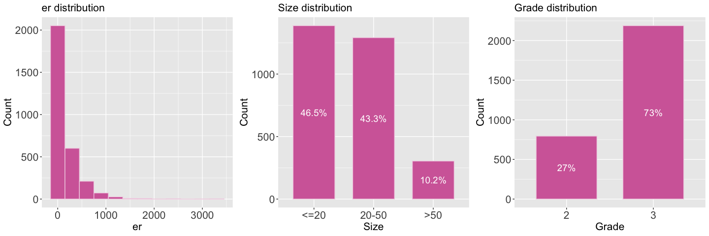
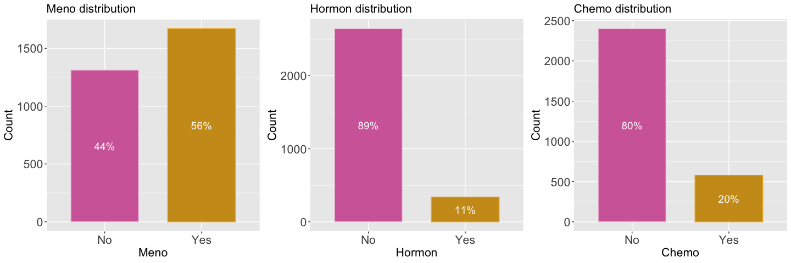

Breast cancer survival analysis with R
================
Melvin Galera
2024-03-26

### I. Project objective

<br> <br>

### II. Exploratory Data Analysis

**A. Data Collection**

In this project, the in-built dataset “rotterdam” from the survival
package in R was used. This dataset has 2982 records of patients with
primary breast cancers available in the Rotterdam tumor bank. It has 15
variables:

- `pid` : patient identifier
- `year` : year of surgery  
- `age` : patient’s age at surgery
- `meno` : patient’s menopausal status (0 = premenopausal, 1 =
  postmenopausal)
- `size` : the range of tumor sizes (\<=20, 20-50, 50\<)
- `grade` : differentiation grade of tumor
- `nodes` : number of lymph nodes noted to be positive
- `pgr` : biomarker of progesterone receptor (fmol/l)
- `er` : biomarker of estrogen receptor (fmol/l)
- `hormon` : indicates whether hormonal treatment was received or not (0
  = no, 1 = yes)
- `chemo` : indicates whether chemotherapy was received or not
- \`rtime\`\` : days to relapse or lost-to-follow-up
- \`recur\`\` : indicates whether the patient has had a recurrence or
  not (0 = no relapse, 1 = relapse)
- `dtime` : duration of survival or days to death or last follow up
- `death` : indicates whether the patient is alive or not (0 = alive, 1
  = dead)

<br>

**B. Data Exploration**

An initial look at the structure of the dataset (`cancer_df`) shows:

    ## 'data.frame':    2982 obs. of  15 variables:
    ##  $ pid   : int  1 2 3 4 5 6 7 8 9 10 ...
    ##  $ year  : int  1992 1984 1983 1985 1983 1983 1993 1988 1988 1988 ...
    ##  $ age   : int  74 79 44 70 75 52 40 53 60 52 ...
    ##  $ meno  : int  1 1 0 1 1 0 0 1 1 0 ...
    ##  $ size  : Factor w/ 3 levels "<=20","20-50",..: 1 2 1 2 1 1 1 1 1 2 ...
    ##  $ grade : int  3 3 2 3 3 3 2 2 2 3 ...
    ##  $ nodes : int  0 0 0 0 0 0 0 0 0 5 ...
    ##  $ pgr   : int  35 36 138 0 260 139 13 1 627 316 ...
    ##  $ er    : int  291 611 0 12 409 303 4 4 151 976 ...
    ##  $ hormon: int  0 0 0 0 0 0 0 0 0 0 ...
    ##  $ chemo : int  0 0 0 0 0 0 0 0 0 0 ...
    ##  $ rtime : num  1799 2828 6012 2624 4915 ...
    ##  $ recur : int  0 0 0 0 0 0 0 0 0 0 ...
    ##  $ dtime : num  1799 2828 6012 2624 4915 ...
    ##  $ death : int  0 0 0 0 0 0 0 0 0 0 ...

The first 10 records of `cancer_df`:

    ##      pid year age meno  size grade nodes pgr  er hormon chemo rtime recur dtime
    ## 1393   1 1992  74    1  <=20     3     0  35 291      0     0  1799     0  1799
    ## 1416   2 1984  79    1 20-50     3     0  36 611      0     0  2828     0  2828
    ## 2962   3 1983  44    0  <=20     2     0 138   0      0     0  6012     0  6012
    ## 1455   4 1985  70    1 20-50     3     0   0  12      0     0  2624     0  2624
    ## 977    5 1983  75    1  <=20     3     0 260 409      0     0  4915     0  4915
    ## 617    6 1983  52    0  <=20     3     0 139 303      0     0  5888     0  5888
    ## 51     7 1993  40    0  <=20     2     0  13   4      0     0  2491     0  2491
    ## 473    8 1988  53    1  <=20     2     0   1   4      0     0  4150     0  4150
    ## 362    9 1988  60    1  <=20     2     0 627 151      0     0  3919     0  3919
    ## 2182  10 1988  52    0 20-50     3     5 316 976      0     0  3647     0  3647
    ##      death
    ## 1393     0
    ## 1416     0
    ## 2962     0
    ## 1455     0
    ## 977      0
    ## 617      0
    ## 51       0
    ## 473      0
    ## 362      0
    ## 2182     0

<br>

Values of some features were grouped as factors. The feature `age` was
factored as `age.group` with levels “24-60” and “61-90”. The feature
`nodes` was factored as `nodes.group` with levels “0-10”, “11-20”, and
“21-34”. Other features such as `grade`, `meno`, `hormon`, `chemo`,
`recur`, and `death` were also factored into levels “no” and “yes” (see
the ‘F’ added in the names to indicate factored).

Summary statistics of the resulting relevant features are shown below.
There are no missing data in each feature.

    ##       year           age        age.group        nodes        nodes.group 
    ##  Min.   :1978   Min.   :24.00   24-60:1907   Min.   : 0.000   0-10 :2770  
    ##  1st Qu.:1986   1st Qu.:45.00   61-90:1075   1st Qu.: 0.000   11-20: 190  
    ##  Median :1988   Median :54.00                Median : 1.000   21-34:  22  
    ##  Mean   :1988   Mean   :55.06                Mean   : 2.712               
    ##  3rd Qu.:1990   3rd Qu.:65.00                3rd Qu.: 4.000               
    ##  Max.   :1993   Max.   :90.00                Max.   :34.000

    ##       pgr               er            size      gradeF   menoF     
    ##  Min.   :   0.0   Min.   :   0.0   <=20 :1387   2: 794   No :1312  
    ##  1st Qu.:   4.0   1st Qu.:  11.0   20-50:1291   3:2188   Yes:1670  
    ##  Median :  41.0   Median :  61.0   >50  : 304                      
    ##  Mean   : 161.8   Mean   : 166.6                                   
    ##  3rd Qu.: 198.0   3rd Qu.: 202.8                                   
    ##  Max.   :5004.0   Max.   :3275.0

    ##  hormonF    chemoF     recurF     deathF    
    ##  No :2643   No :2402   No :1464   No :1710  
    ##  Yes: 339   Yes: 580   Yes:1518   Yes:1272

<br>

**Univariate plots**


<br>


<br>


<br>


<br>

Fit model for overall survival death: censoring status (0=
censored/alive, 1= dead) dtime: days until event or censoring

<br>

**Survival data representations and censoring**

In survival analysis, the interest is on analyzing data where the
outcome variable is time to an event, measured from a defined starting
point. In this analysis, the outcome variable is `dtime` which is the
duration of survival or the days to death or last follow-up of breast
cancer patients. The event of interest is death as indicated by the
variable `death` (class 1/yes - dead) and the starting point is the
patient’s surgery indicated by the year of surgery (`year`)and age of
patient at surgery (`age`).

The figure below shows a histogram of `dtime` and count of patients
based on `death` status for the study period.


<br>

In the dataset, censoring occurs when information about a patient’s
survival is incomplete based on the available data. Since there is no
missing value in the `year`, it can be said that there can be right
censoring in the dataset, i.e., some patients may not have died by the
end of study period (alive), some patients might have been lost to
follow up or have died after the study period (censored). These can be
seen in the graphical representations of survival data below.

The figure below shows survival data of randomly selected 30 breast
cancer patients from the dataset. The survival data is represented using
the triplet - entry age, exit age, event. From the starting point which
was the `age` at surgery, the patient was followed until they experience
the event (death) or they are censored. If the patient had a recurrence
(1-relapse) within the study period, it is marked marked by a ‘purple’
dot.


<br>

Another way to present survival data of the 30 sampled patients is using
the pair: follow-up (survival) time, event. This is shown in the figure
below.


<br> <br>

### III. Kaplan-Meier Survival Curves and Log Rank Tests

**A. Kaplan-Meier Curves**

Kaplan- Meier curves are non-parametric summary of the probability of
survival past a certain time. The KM survival curve of the breast cancer
patients from the dataset is shown below:

``` r
mod01_sfit <- survfit(Surv(dtime, death) ~ 1, data = cancer_df)
```


    ##   strata median lower upper
    ## 1    All   4033  3888  4309

The median survival time for the breast cancer patients in the dataset
is 4033 days.

    ## Call: survfit(formula = Surv(dtime, death) ~ 1, data = cancer_df)
    ## 
    ##  time n.risk n.event survival std.err lower 95% CI upper 95% CI
    ##  1825   2084     753    0.744 0.00807        0.728         0.76

<br>

Separate KM curves can also be plotted and compared for different
variables to explore if different values/levels of the variables affect
survival probabilities. Below are the KM curves for the features
`age.group`, `menoF`, `nodes.group`, `hormonF`, `size`, `chemoF`,
`gradeF`, and `recurF`.


<br>

**B. Log Rank test**

Log rank test was used to determine if differences in the survival
curves of each feature/variable were significant. For instance, using
the log rank test for `gradeF`:

``` r
log.rank.grade <- coxph(Surv(dtime, death) ~ gradeF, data = cancer_df)
summary(log.rank.grade)
```

    ## Call:
    ## coxph(formula = Surv(dtime, death) ~ gradeF, data = cancer_df)
    ## 
    ##   n= 2982, number of events= 1272 
    ## 
    ##            coef exp(coef) se(coef)     z Pr(>|z|)    
    ## gradeF3 0.50600   1.65864  0.06945 7.286 3.19e-13 ***
    ## ---
    ## Signif. codes:  0 '***' 0.001 '**' 0.01 '*' 0.05 '.' 0.1 ' ' 1
    ## 
    ##         exp(coef) exp(-coef) lower .95 upper .95
    ## gradeF3     1.659     0.6029     1.448       1.9
    ## 
    ## Concordance= 0.55  (se = 0.006 )
    ## Likelihood ratio test= 58.27  on 1 df,   p=2e-14
    ## Wald test            = 53.09  on 1 df,   p=3e-13
    ## Score (logrank) test = 54.22  on 1 df,   p=2e-13

The result shows that the difference between the survival curves are
significant (low p-value). The median survival time for those who have
tumor differentiation grade 2 was 5653 days while 3700 days for those
with tumor grade 3 (shown below and also in the KM curve).

    ##     strata median lower upper
    ## 1 gradeF=2   5653  4782    NA
    ## 2 gradeF=3   3700  3540  3977

<br>

The table below shows a summary of the log rank test results performed
on the features. The features `er` (estrogen receptor biomarker) and
`chemoF` (indicator of whether the patient received chemotherapy) both
have KM survival curves that have statistically non-significant
firrences.

<table style="border-collapse:collapse; border:none;">
<tr>
<th style="border-top: double; text-align:center; font-style:italic; font-weight:normal; padding:0.2cm; border-bottom:1px solid black; text-align:left; ">
Row
</th>
<th style="border-top: double; text-align:center; font-style:italic; font-weight:normal; padding:0.2cm; border-bottom:1px solid black; ">
Score..logrank..test
</th>
<th style="border-top: double; text-align:center; font-style:italic; font-weight:normal; padding:0.2cm; border-bottom:1px solid black; ">
df
</th>
<th style="border-top: double; text-align:center; font-style:italic; font-weight:normal; padding:0.2cm; border-bottom:1px solid black; ">
p.value
</th>
<th style="border-top: double; text-align:center; font-style:italic; font-weight:normal; padding:0.2cm; border-bottom:1px solid black; ">
Remark
</th>
</tr>
<tr>
<td style=" padding:0.2cm; text-align:left; vertical-align:top; text-align:left; ">
age.group
</td>
<td style=" padding:0.2cm; text-align:left; vertical-align:top; text-align:center; ">
53.4291
</td>
<td style=" padding:0.2cm; text-align:left; vertical-align:top; text-align:center; ">
1
</td>
<td style=" padding:0.2cm; text-align:left; vertical-align:top; text-align:center; ">
0.0000
</td>
<td style=" padding:0.2cm; text-align:left; vertical-align:top; text-align:center; ">
The survival curves have statistically significant differences.
</td>
</tr>
<tr>
<td style=" padding:0.2cm; text-align:left; vertical-align:top; text-align:left; ">
nodes.group
</td>
<td style=" padding:0.2cm; text-align:left; vertical-align:top; text-align:center; ">
220.5267
</td>
<td style=" padding:0.2cm; text-align:left; vertical-align:top; text-align:center; ">
2
</td>
<td style=" padding:0.2cm; text-align:left; vertical-align:top; text-align:center; ">
0.0000
</td>
<td style=" padding:0.2cm; text-align:left; vertical-align:top; text-align:center; ">
The survival curves have statistically significant differences.
</td>
</tr>
<tr>
<td style=" padding:0.2cm; text-align:left; vertical-align:top; text-align:left; ">
pgr
</td>
<td style=" padding:0.2cm; text-align:left; vertical-align:top; text-align:center; ">
23.6988
</td>
<td style=" padding:0.2cm; text-align:left; vertical-align:top; text-align:center; ">
1
</td>
<td style=" padding:0.2cm; text-align:left; vertical-align:top; text-align:center; ">
0.0000
</td>
<td style=" padding:0.2cm; text-align:left; vertical-align:top; text-align:center; ">
The survival curves have statistically significant differences.
</td>
</tr>
<tr>
<td style=" padding:0.2cm; text-align:left; vertical-align:top; text-align:left; ">
er
</td>
<td style=" padding:0.2cm; text-align:left; vertical-align:top; text-align:center; ">
0.5950
</td>
<td style=" padding:0.2cm; text-align:left; vertical-align:top; text-align:center; ">
1
</td>
<td style=" padding:0.2cm; text-align:left; vertical-align:top; text-align:center; ">
0.4405
</td>
<td style=" padding:0.2cm; text-align:left; vertical-align:top; text-align:center; ">
The survival curves have statistically non-significant differences
</td>
</tr>
<tr>
<td style=" padding:0.2cm; text-align:left; vertical-align:top; text-align:left; ">
size
</td>
<td style=" padding:0.2cm; text-align:left; vertical-align:top; text-align:center; ">
280.8799
</td>
<td style=" padding:0.2cm; text-align:left; vertical-align:top; text-align:center; ">
2
</td>
<td style=" padding:0.2cm; text-align:left; vertical-align:top; text-align:center; ">
0.0000
</td>
<td style=" padding:0.2cm; text-align:left; vertical-align:top; text-align:center; ">
The survival curves have statistically significant differences.
</td>
</tr>
<tr>
<td style=" padding:0.2cm; text-align:left; vertical-align:top; text-align:left; ">
gradeF
</td>
<td style=" padding:0.2cm; text-align:left; vertical-align:top; text-align:center; ">
54.2198
</td>
<td style=" padding:0.2cm; text-align:left; vertical-align:top; text-align:center; ">
1
</td>
<td style=" padding:0.2cm; text-align:left; vertical-align:top; text-align:center; ">
0.0000
</td>
<td style=" padding:0.2cm; text-align:left; vertical-align:top; text-align:center; ">
The survival curves have statistically significant differences.
</td>
</tr>
<tr>
<td style=" padding:0.2cm; text-align:left; vertical-align:top; text-align:left; ">
menoF
</td>
<td style=" padding:0.2cm; text-align:left; vertical-align:top; text-align:center; ">
55.0560
</td>
<td style=" padding:0.2cm; text-align:left; vertical-align:top; text-align:center; ">
1
</td>
<td style=" padding:0.2cm; text-align:left; vertical-align:top; text-align:center; ">
0.0000
</td>
<td style=" padding:0.2cm; text-align:left; vertical-align:top; text-align:center; ">
The survival curves have statistically significant differences.
</td>
</tr>
<tr>
<td style=" padding:0.2cm; text-align:left; vertical-align:top; text-align:left; ">
hormonF
</td>
<td style=" padding:0.2cm; text-align:left; vertical-align:top; text-align:center; ">
23.6860
</td>
<td style=" padding:0.2cm; text-align:left; vertical-align:top; text-align:center; ">
1
</td>
<td style=" padding:0.2cm; text-align:left; vertical-align:top; text-align:center; ">
0.0000
</td>
<td style=" padding:0.2cm; text-align:left; vertical-align:top; text-align:center; ">
The survival curves have statistically significant differences.
</td>
</tr>
<tr>
<td style=" padding:0.2cm; text-align:left; vertical-align:top; text-align:left; ">
chemoF
</td>
<td style=" padding:0.2cm; text-align:left; vertical-align:top; text-align:center; ">
0.4947
</td>
<td style=" padding:0.2cm; text-align:left; vertical-align:top; text-align:center; ">
1
</td>
<td style=" padding:0.2cm; text-align:left; vertical-align:top; text-align:center; ">
0.4818
</td>
<td style=" padding:0.2cm; text-align:left; vertical-align:top; text-align:center; ">
The survival curves have statistically non-significant differences
</td>
</tr>
<tr>
<td style=" padding:0.2cm; text-align:left; vertical-align:top; text-align:left; border-bottom: double; ">
recurF
</td>
<td style=" padding:0.2cm; text-align:left; vertical-align:top; text-align:center; border-bottom: double; ">
945.9441
</td>
<td style=" padding:0.2cm; text-align:left; vertical-align:top; text-align:center; border-bottom: double; ">
1
</td>
<td style=" padding:0.2cm; text-align:left; vertical-align:top; text-align:center; border-bottom: double; ">
0.0000
</td>
<td style=" padding:0.2cm; text-align:left; vertical-align:top; text-align:center; border-bottom: double; ">
The survival curves have statistically significant differences.
</td>
</tr>
</table>

<br> <br>

### IV. Cox proportional hazard regression models

These models give us estimates of the “hazard ratio”

1.  Model 1 - Univariable Cox model (same as above)
2.  Model 2 - Multivariable Cox model (except er and chemoF)
3.  Model 3 - Stratified model

Models are detailed below.

<br>

**Model 1 - Univariable Cox model**

``` r
surv.model <- coxph(Surv(dtime, death) ~ age.group + nodes.group + pgr + size +
                      gradeF + menoF + hormonF + recurF, data = cancer_df)
summary(surv.model)
```

    ## Call:
    ## coxph(formula = Surv(dtime, death) ~ age.group + nodes.group + 
    ##     pgr + size + gradeF + menoF + hormonF + recurF, data = cancer_df)
    ## 
    ##   n= 2982, number of events= 1272 
    ## 
    ##                        coef  exp(coef)   se(coef)      z Pr(>|z|)    
    ## age.group61-90    0.2240471  1.2511299  0.0767418  2.919  0.00351 ** 
    ## nodes.group11-20  0.5181303  1.6788857  0.0912903  5.676 1.38e-08 ***
    ## nodes.group21-34  0.0465676  1.0476689  0.2618326  0.178  0.85884    
    ## pgr              -0.0005280  0.9994722  0.0001174 -4.496 6.93e-06 ***
    ## size20-50         0.4245920  1.5289665  0.0640982  6.624 3.49e-11 ***
    ## size>50           0.8332948  2.3008871  0.0881264  9.456  < 2e-16 ***
    ## gradeF3           0.1908043  1.2102226  0.0704163  2.710  0.00674 ** 
    ## menoFYes          0.2422161  1.2740695  0.0794312  3.049  0.00229 ** 
    ## hormonFYes        0.0535491  1.0550088  0.0889749  0.602  0.54728    
    ## recurFYes         1.9372098  6.9393616  0.0789520 24.537  < 2e-16 ***
    ## ---
    ## Signif. codes:  0 '***' 0.001 '**' 0.01 '*' 0.05 '.' 0.1 ' ' 1
    ## 
    ##                  exp(coef) exp(-coef) lower .95 upper .95
    ## age.group61-90      1.2511     0.7993    1.0764    1.4542
    ## nodes.group11-20    1.6789     0.5956    1.4038    2.0078
    ## nodes.group21-34    1.0477     0.9545    0.6271    1.7502
    ## pgr                 0.9995     1.0005    0.9992    0.9997
    ## size20-50           1.5290     0.6540    1.3485    1.7336
    ## size>50             2.3009     0.4346    1.9359    2.7347
    ## gradeF3             1.2102     0.8263    1.0542    1.3893
    ## menoFYes            1.2741     0.7849    1.0904    1.4887
    ## hormonFYes          1.0550     0.9479    0.8862    1.2560
    ## recurFYes           6.9394     0.1441    5.9445    8.1007
    ## 
    ## Concordance= 0.774  (se = 0.006 )
    ## Likelihood ratio test= 1256  on 10 df,   p=<2e-16
    ## Wald test            = 960.4  on 10 df,   p=<2e-16
    ## Score (logrank) test = 1271  on 10 df,   p=<2e-16

<br>

**Model 2 - Multivariable Cox model**

To check if the multivariable cox model is better than a complex one
(complete)

    ## Call:
    ## coxph(formula = Surv(dtime, death) ~ age.group + nodes.group + 
    ##     pgr + er + size + gradeF + menoF + hormonF + chemoF + recurF, 
    ##     data = cancer_df)
    ## 
    ##   n= 2982, number of events= 1272 
    ## 
    ##                        coef  exp(coef)   se(coef)      z Pr(>|z|)    
    ## age.group61-90    0.2577827  1.2940576  0.0781703  3.298 0.000975 ***
    ## nodes.group11-20  0.5116511  1.6680431  0.0914657  5.594 2.22e-08 ***
    ## nodes.group21-34  0.0011451  1.0011458  0.2627343  0.004 0.996522    
    ## pgr              -0.0004742  0.9995260  0.0001215 -3.903 9.48e-05 ***
    ## er               -0.0001919  0.9998081  0.0001128 -1.701 0.088857 .  
    ## size20-50         0.4224261  1.5256585  0.0641180  6.588 4.45e-11 ***
    ## size>50           0.8167511  2.2631351  0.0884674  9.232  < 2e-16 ***
    ## gradeF3           0.1936178  1.2136324  0.0704742  2.747 0.006008 ** 
    ## menoFYes          0.3036060  1.3547351  0.0834620  3.638 0.000275 ***
    ## hormonFYes        0.0568856  1.0585347  0.0889748  0.639 0.522598    
    ## chemoFYes         0.1347615  1.1442639  0.0802104  1.680 0.092938 .  
    ## recurFYes         1.9395115  6.9553524  0.0789935 24.553  < 2e-16 ***
    ## ---
    ## Signif. codes:  0 '***' 0.001 '**' 0.01 '*' 0.05 '.' 0.1 ' ' 1
    ## 
    ##                  exp(coef) exp(-coef) lower .95 upper .95
    ## age.group61-90      1.2941     0.7728    1.1102    1.5083
    ## nodes.group11-20    1.6680     0.5995    1.3943    1.9956
    ## nodes.group21-34    1.0011     0.9989    0.5982    1.6755
    ## pgr                 0.9995     1.0005    0.9993    0.9998
    ## er                  0.9998     1.0002    0.9996    1.0000
    ## size20-50           1.5257     0.6555    1.3455    1.7300
    ## size>50             2.2631     0.4419    1.9029    2.6916
    ## gradeF3             1.2136     0.8240    1.0571    1.3934
    ## menoFYes            1.3547     0.7382    1.1503    1.5955
    ## hormonFYes          1.0585     0.9447    0.8891    1.2602
    ## chemoFYes           1.1443     0.8739    0.9778    1.3391
    ## recurFYes           6.9554     0.1438    5.9577    8.1200
    ## 
    ## Concordance= 0.775  (se = 0.006 )
    ## Likelihood ratio test= 1262  on 12 df,   p=<2e-16
    ## Wald test            = 963.3  on 12 df,   p=<2e-16
    ## Score (logrank) test = 1275  on 12 df,   p=<2e-16

<br>

**Comparison of models**

    ## Analysis of Deviance Table
    ##  Cox model: response is  Surv(dtime, death)
    ##  Model 1: ~ age.group + nodes.group + pgr + size + gradeF + menoF + hormonF + recurF
    ##  Model 2: ~ age.group + nodes.group + pgr + er + size + gradeF + menoF + hormonF + chemoF + recurF
    ##    loglik  Chisq Df Pr(>|Chi|)  
    ## 1 -8899.1                       
    ## 2 -8896.1 5.9876  2     0.0501 .
    ## ---
    ## Signif. codes:  0 '***' 0.001 '**' 0.01 '*' 0.05 '.' 0.1 ' ' 1

P-value is high which means we can use the reduced model.

Comparing univariate and multivariate via table

| Dependent: Surv(dtime, death) |           |           all |           HR (univariable) |         HR (multivariable) |
|:------------------------------|:----------|--------------:|---------------------------:|---------------------------:|
| age.group                     | 24-60     |   1907 (64.0) |                         \- |                         \- |
|                               | 61-90     |   1075 (36.0) | 1.51 (1.35-1.69, p\<0.001) |  1.25 (1.08-1.45, p=0.004) |
| nodes.group                   | 0-10      |   2770 (92.9) |                         \- |                         \- |
|                               | 11-20     |     190 (6.4) | 3.36 (2.83-4.00, p\<0.001) | 1.68 (1.40-2.01, p\<0.001) |
|                               | 21-34     |      22 (0.7) |  2.34 (1.40-3.89, p=0.001) |  1.05 (0.63-1.75, p=0.859) |
| pgr                           | Mean (SD) | 161.8 (291.3) | 1.00 (1.00-1.00, p\<0.001) | 1.00 (1.00-1.00, p\<0.001) |
| er                            | Mean (SD) | 166.6 (272.5) |  1.00 (1.00-1.00, p=0.440) |                         \- |
| size                          | \<=20     |   1387 (46.5) |                         \- |                         \- |
|                               | 20-50     |   1291 (43.3) | 1.95 (1.73-2.21, p\<0.001) | 1.53 (1.35-1.73, p\<0.001) |
|                               | \>50      |    304 (10.2) | 3.74 (3.17-4.42, p\<0.001) | 2.30 (1.94-2.73, p\<0.001) |
| gradeF                        | 2         |    794 (26.6) |                         \- |                         \- |
|                               | 3         |   2188 (73.4) | 1.66 (1.45-1.90, p\<0.001) |  1.21 (1.05-1.39, p=0.007) |
| menoF                         | No        |   1312 (44.0) |                         \- |                         \- |
|                               | Yes       |   1670 (56.0) | 1.54 (1.37-1.72, p\<0.001) |  1.27 (1.09-1.49, p=0.002) |
| hormonF                       | No        |   2643 (88.6) |                         \- |                         \- |
|                               | Yes       |    339 (11.4) | 1.51 (1.28-1.79, p\<0.001) |  1.06 (0.89-1.26, p=0.547) |
| chemoF                        | No        |   2402 (80.5) |                         \- |                         \- |
|                               | Yes       |    580 (19.5) |  1.05 (0.92-1.20, p=0.482) |                         \- |
| recurF                        | No        |   1464 (49.1) |                         \- |                         \- |
|                               | Yes       |   1518 (50.9) | 7.68 (6.59-8.95, p\<0.001) | 6.94 (5.94-8.10, p\<0.001) |

<br>

**Model Diagnostics**

Assess any violation of the proportionality assumption through
statistical test based on Schoenfeld residuals.

``` r
stat.test <- cox.zph(surv.model)
stat.test
```

    ##               chisq df       p
    ## age.group    8.0457  1  0.0046
    ## nodes.group  4.6195  2  0.0993
    ## pgr         25.1103  1 5.4e-07
    ## size         1.9310  2  0.3808
    ## gradeF       2.4021  1  0.1212
    ## menoF        2.6874  1  0.1011
    ## hormonF      1.4150  1  0.2342
    ## recurF       0.0164  1  0.8982
    ## GLOBAL      39.3971 10 2.2e-05

For this test, significant p-values indicate non-proportional hazards.
We can say that `age.group` adn `pgr` variables violate the proportional
hazard assumption. This is also evident from the low p-value (\<0.05) of
the ‘GLOBAL’ test.

Plot of Schoenfeld residuals against `dtime`.


We can address these using stratification.

**Model 3 - Stratified model**

    ## Call:
    ## coxph(formula = Surv(dtime, death) ~ strata(age.group) + nodes.group + 
    ##     strata(pgr) + size + gradeF + menoF + hormonF + recurF, data = cancer_df)
    ## 
    ##   n= 2982, number of events= 1272 
    ## 
    ##                      coef exp(coef) se(coef)      z Pr(>|z|)    
    ## nodes.group11-20  0.58249   1.79049  0.12519  4.653 3.27e-06 ***
    ## nodes.group21-34 -0.23913   0.78731  0.33827 -0.707   0.4796    
    ## size20-50         0.42045   1.52265  0.08476  4.961 7.03e-07 ***
    ## size>50           0.80707   2.24134  0.11721  6.886 5.76e-12 ***
    ## gradeF3           0.18142   1.19892  0.09815  1.848   0.0645 .  
    ## menoFYes          0.20441   1.22681  0.09834  2.079   0.0377 *  
    ## hormonFYes       -0.03654   0.96412  0.11513 -0.317   0.7509    
    ## recurFYes         2.29017   9.87663  0.11157 20.526  < 2e-16 ***
    ## ---
    ## Signif. codes:  0 '***' 0.001 '**' 0.01 '*' 0.05 '.' 0.1 ' ' 1
    ## 
    ##                  exp(coef) exp(-coef) lower .95 upper .95
    ## nodes.group11-20    1.7905     0.5585    1.4009     2.288
    ## nodes.group21-34    0.7873     1.2701    0.4057     1.528
    ## size20-50           1.5227     0.6567    1.2896     1.798
    ## size>50             2.2413     0.4462    1.7813     2.820
    ## gradeF3             1.1989     0.8341    0.9891     1.453
    ## menoFYes            1.2268     0.8151    1.0117     1.488
    ## hormonFYes          0.9641     1.0372    0.7694     1.208
    ## recurFYes           9.8766     0.1012    7.9367    12.291
    ## 
    ## Concordance= 0.786  (se = 0.012 )
    ## Likelihood ratio test= 858.8  on 8 df,   p=<2e-16
    ## Wald test            = 547.6  on 8 df,   p=<2e-16
    ## Score (logrank) test = 781.9  on 8 df,   p=<2e-16

``` r
cox.zph(surv.model.stratified)
```

    ##               chisq df    p
    ## nodes.group 3.84023  2 0.15
    ## size        0.26048  2 0.88
    ## gradeF      2.31471  1 0.13
    ## menoF       0.00695  1 0.93
    ## hormonF     1.95171  1 0.16
    ## recurF      0.02358  1 0.88
    ## GLOBAL      9.03427  8 0.34

The ’global\` test for proportionality now shows a p-value above 0.05
which means the assumption is not violated.

<br>

**Hazard Ratio**


<br> <br>

### V. Conclusion

### Hazard Ratio


